## Logan De Jésus 🐉
Salut ! Je suis développeur de jeux vidéo et adore ça !

Contactez-moi : logan.dejesus1@gmail.com

Vous trouverez tous mes projets réalisés, persos ou réalisés au travail

Mon CV : 
[Téléchargement pdf](docs/pdf/CV-DeJesusLogan.pdf)

<link rel="stylesheet" href="docs/styles.css">

## Mes compétences informatiques

| **Catégorie**        | **Détails**                                     | **Compétences**                                         |
|-----------------------|------------------------------------------------|--------------------------------------------------------|
| **Jeux Vidéo**       | Développement de jeux                          | Unity, C# \|  Unreal Engine, BluePrint                               |
|                       | Modélisation 3D                               | Blender                                                |
|                       | Méthodologies                                 | POO (Programmation Orientée Objet), COO, UML           |
| **Développement Web** | Frontend                                      | HTML, CSS, JavaScript, Ajax                            |
|                       | Backend                                       | PHP, SQL, Relation Client-Serveur                     |
| **Langages Divers**   | Langages de programmation                     | Java, Python, C                                        |
|                       | Graphisme 3D                                  | OpenGL                                                 |
|                       | Développement Mobile                          | MAUI                                                   |
|                       | Conteneurisation                              | Docker                                                 |

#  Mes expériences Professionnelles
2022-2025 Cnam Paca Toulon 

Développeur 3D d'expériences immersives

- Développement Réalité Virtuelle sous Unity 3D
- Programmation et réalisation des environnements
- Création Expérience Multijoueur dans le métaverse Spatial.io
- Gestion de projet et relation client
- Animer et former aux usages des technologies immersives
- Réalisation Vidéo et Visite 360
- Collaborer avec équipe à l'international

# Mes projets personnels

<article>

## BuildTech (2024)

Description : Build Tech est un projet inspiré du jeu TerraTech, un jeu 3D où l'on peut créer son propre véhicule et se déplacer avec.
A la différence du jeu original, j'ai implémenté le multijoueur avec l'outil Photon Fusion

#### Infos
- Moteur : Unity
- Jouabilité : Clavier Souris
- Multijoueur (Outil : Photon Fusion)

#### Développement Compétences
- Programmation Multijoueur
- Système création bac à sable
- Gestion de la physique de véhicules
- Création d'un environnement stylizé avec shaders customisés

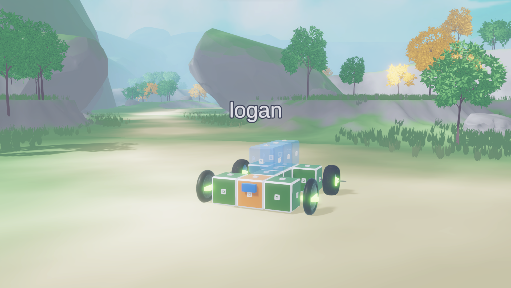
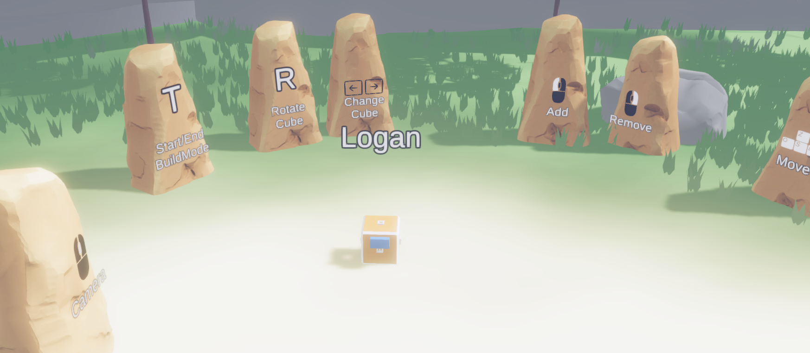
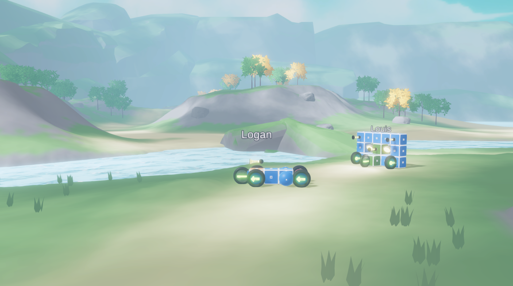

</article>

## SAO VR (2023)

Description : J'ai recréé en VR une scène iconique de l'animé Sword Art Online se déroulant le 24 décembre 2023.
J'ai recréé une majeur partie de cette séquence pour fêter cette date.

#### Infos
- Moteur : Unity
- Jouabilité : VR

#### Développement Compétences
- Programmation VR
- Cinématique (Outil Timeline Unity)
- Recréation d'environnement existants
- Gestion du corps VR (Animation Rigging)
- Programmation de l'UI de SAO

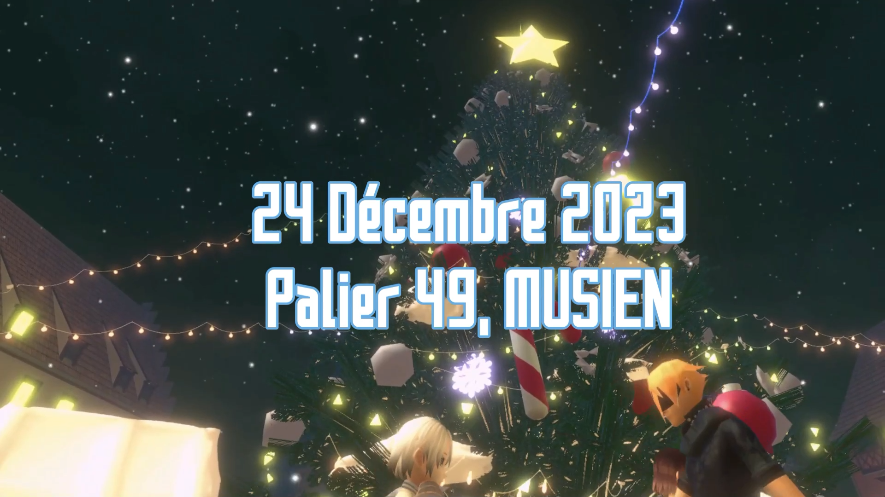
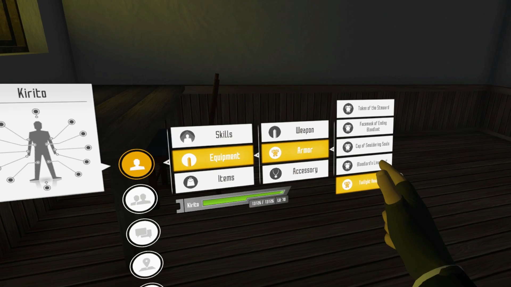
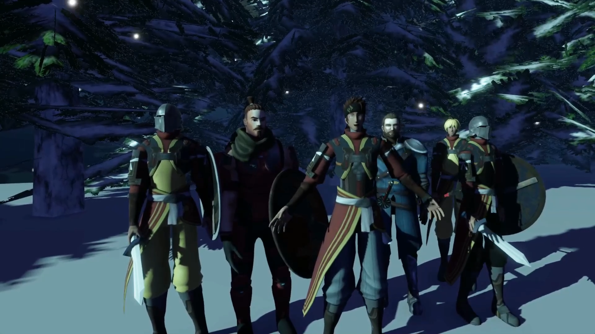
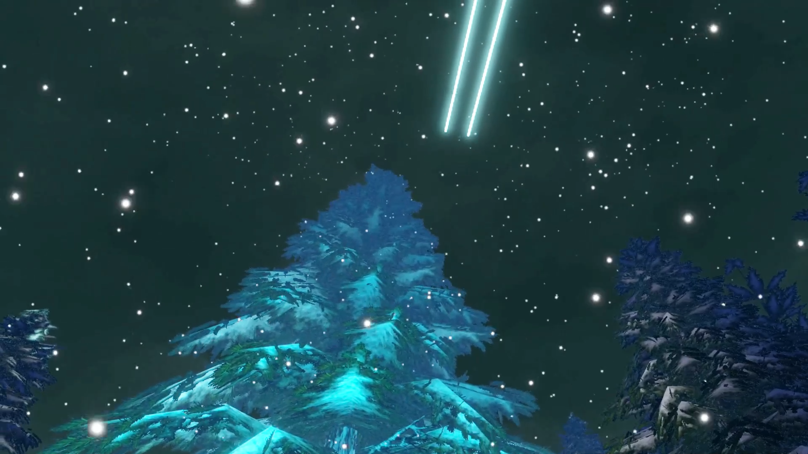
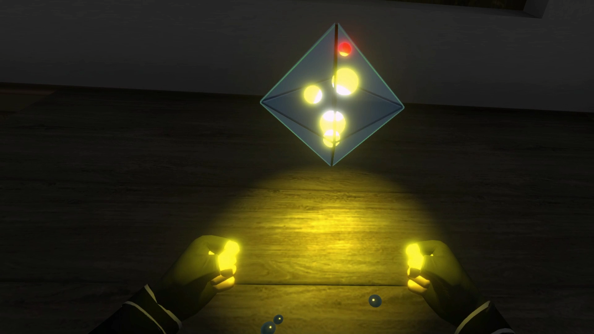
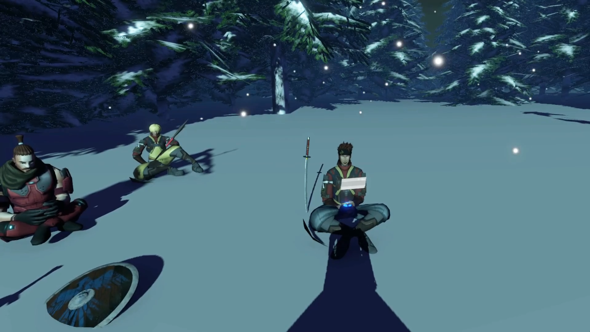

Vidéo youtube : 

## Elysion (2022)

Description : Projet d'étude en équipe de 3. Jeu d'aventure, d'énigme et de combat. 

Histoire :
Suite à une invasion étrangère, la planète Elysion subit de gros dégâts. Une seule personne arrive à survivre et on la retrouve 15 ans plus tard. Vous incarnez un personnage soif de vengeance qui va explorer, combattre et résoudre des énigmes avec un concept inédit. Déplacer et orientez les structures qui vous entourent pour vous frayer un chemin vers la vérité.

#### Infos
- Moteur : Unity
- Jouabilité : Clavier Souris

#### Développement Compétences
- Level Desing (outil Landscape)
- Gestion animateurs de personnages
- Collaboration, travail d'équipe avec Git
- Système d'énigme/puzzle avec matrices
- Cinématiques
- StoryTelling

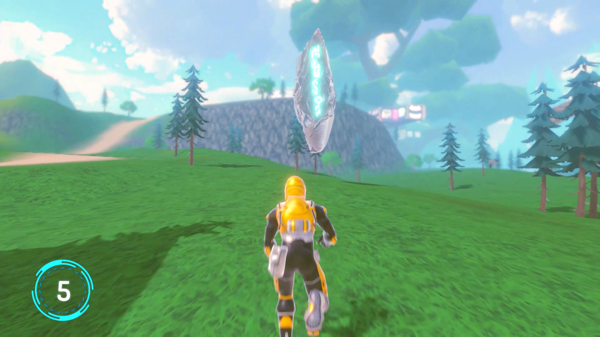

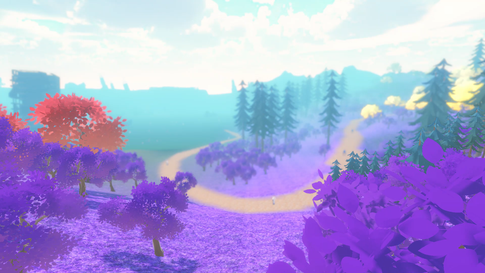
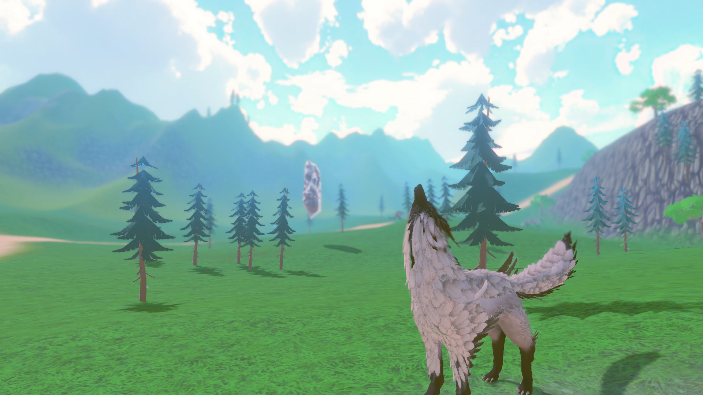

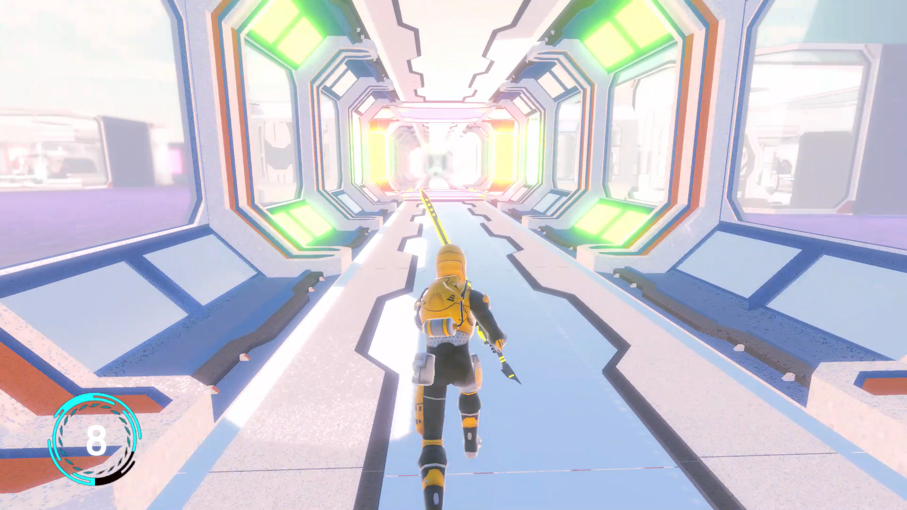

Vidéo youtube : 

<!--
**logandej/logandej** is a ✨ _special_ ✨ repository because its `README.md` (this file) appears on your GitHub profile.
Here are some ideas to get you started:
- 🔭 I’m currently working on ...
- 🌱 I’m currently learning ...
- 👯 I’m looking to collaborate on ...
- 🤔 I’m looking for help with ...
- 💬 Ask me about ...
- 📫 How to reach me: ...
- 😄 Pronouns: ...
- ⚡ Fun fact: ...
-->
